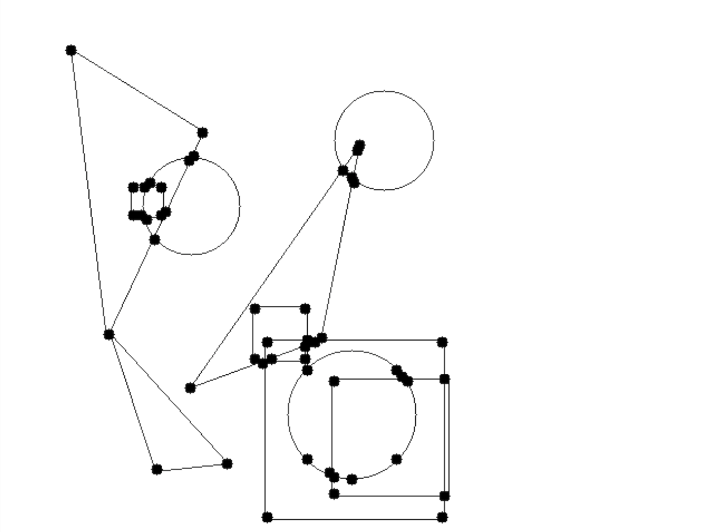
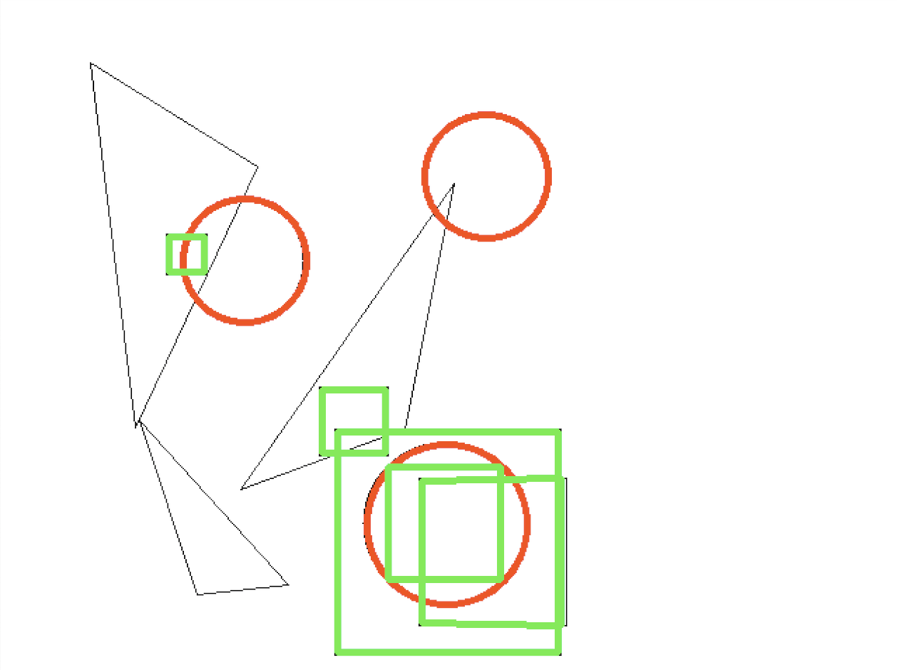
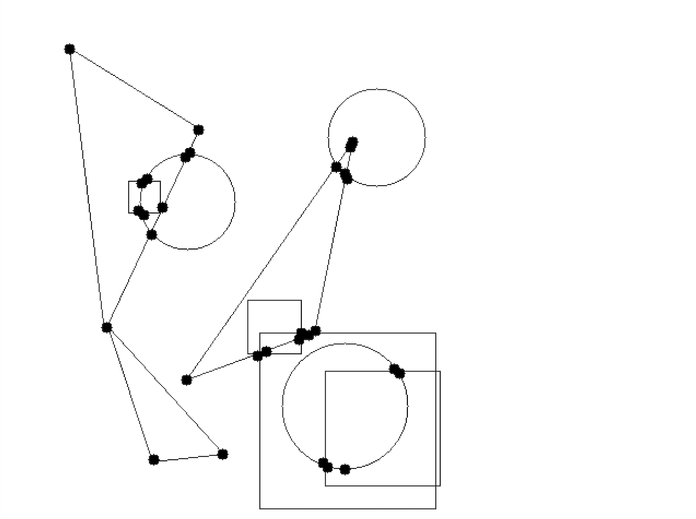

## Shape Finder

Written by: Mehrdad Pourfathi

Date: 9/25/2020

This is a simple routine written with OpenCV with Python back-end to Find randomly position circles, squares and triangles in a binary image. 

#### Dependencies:
* numpy
* OpenCV 2
* itertools
* argparse

#### How to run:
In terminal run the code as:

`python shape_finder.py --circles 3 --squares 4 --triangles 3 --seed 823`

or its short version
`python shape_finder.py -c 3 -sq 4 -t 3 -sd 823`

#### Flags:
c: number of circles
sq: number of squares
t: number of triangles
sd: seed to random generator

#### Files
* `shape_finder.py`: main file.
* `utils/general_utils.py`: contains helper functions to generate images and find shapes.
* `utils/square_utils.py` : contains helper functions used by the `find_squres()` function to check if a square was found. 

#### Algorithm:
1. First we generate a 640x480 image white background and randomly positioned squres, triangles and circles with black boundary, using the `image_maker()` function, avaialble in the `utils/general_utils.py` module.

2. Then, we use the [Hough Circle Transform](https://docs.opencv.org/4.3.0/d4/d70/tutorial_hough_circle.html) to find the circles. This is implemented in the `find_circles()` helper function. The block size of the transform can be adjusted by the user. In this example the circles are found:

3. Next step is to find other shapes. To achieve this we find corner and critical points using the`find_corner_points()` function. This functions uses a modified Harris Corner Detector implemented in OpenCV by `cv2.goodFeaturesToTrack()` [function](https://docs.opencv.org/master/d4/d8c/tutorial_py_shi_tomasi.html). There are three adjustable aprameters here: quality of corner points, maximum number of points to find and minimum distance between points in pixel. The results below show the points found in this example. If there are any points missing we can adjust the parameters.

4. We use these to points to find squares. To do so, we take 4 points from all the corner points, create a contour and check if the contour formed is square. This is done by ensuring that all sides have equal lenghts and the angle between lines that share a vertex is approximately 90 degrees. 

5. We create a set of points that create squares and remove them from the original list. Here is the result for this examples:

### To do:
1. We can write a routine to remove the points on the circle. We can do this check if a point from our corners list coinces with a low value in our image (low value because the boundary of the circle is black and a value of 0.) removing the points on the circle ensures that we have fewer points. 

2. Show the center of the shapes. I have already implemented the function `find_contour_center` in the `utils.square_utils.py` module to find the center of contours. But have not used it.

3. We still have not found the triangles. To do that we can find all contours from the remaining points that can be formed three vertices. To ensure that we select the right triangle, we check to see all the lines in the detected contour conincide with a line from the image. If that is the case, then we can conclude that we have found a triangle. This is the part that I am still working on. 

### Limitations:
1. The algorithm is semi-automatic. While it can work for the majority of the cases, it may require user's input to tune the parameters and get the desired results.
2. The algorithm can be very slow since it has to check all combinations of the points. If we remove the points that are on the circle early in the process, the algorithm will become faster. 